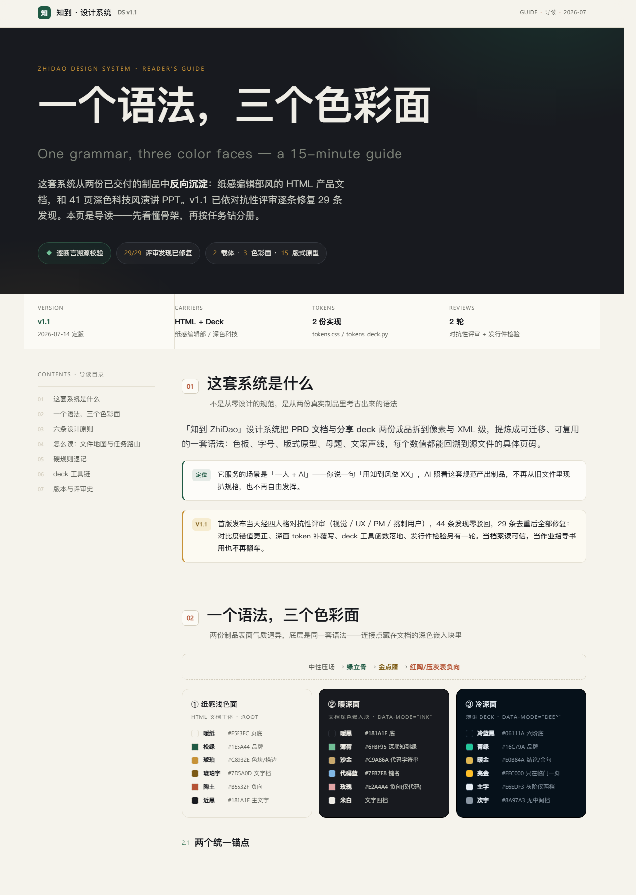

# 知到风 · ZhiDao Style

> **一个语法，三个色彩面。** 一套从真实制品反向沉淀的中文设计系统，
> 同时也是一个开箱即用的 **Agent Skill**——让 Claude Code / Codex 直接按这套规范产出
> 纸感编辑部风的 HTML 文档、深色科技风的演讲 PPT，或把整套设计语法迁移到你自己的品牌。

*ZhiDao Style: a Chinese design system distilled from shipped artifacts (an HTML PRD + a 41-slide dark-tech deck), packaged as an open-standard Agent Skill (SKILL.md) for Claude Code, Codex, and compatible agents. Docs are in Chinese.*



## 这是什么

两份已交付的制品——一份浅色纸感编辑部风的 HTML 产品文档、一份深色科技风的 41 页演讲 PPT——表面气质迥异，底层却是同一套语法。本仓库把这套语法反向沉淀成了可复用的设计系统（知到 DS v1.1）：

- **不是灵感集，是规范**：全部数值经多智能体逐页/逐行提取 + 逐断言溯源校验（58 处修正），再经四人格对抗性评审修复 29 条发现后定版（评审档案就在仓库里，见 `review-20260714.md`）；
- **不是截图集，是可执行资产**：Web 侧给 token + 组件 CSS 直接 `<link>`，deck 侧给 python-pptx 常量库和骨架函数直接 `import`，换色给 WCAG 对比度审计脚本一键跑；
- **不只给人看，也给 agent 用**：仓库根的 `SKILL.md` 遵循 [Agent Skills 开放标准](https://agentskills.io)，装进 skills 目录即可让 AI 编码代理按规范干活，QA 判据（对比度阈值、压暗亮度硬判据、静态自查清单）都写成了机器可执行的口径。

## 快速开始

### 作为 Agent Skill（推荐）

一键安装（自动检测 `~/.claude` 与 `~/.agents`，装到对应 skills 目录）：

```bash
npx zhidao-style
```

升级 = 重跑 `npx zhidao-style@latest`；装进当前项目用 `--project`，其余选项见 `npx zhidao-style --help`。

也可手动把整个仓库拷进 skills 目录（目录名保持 `zhidao-style`）：

```bash
# Claude Code
git clone https://github.com/samhihi/zhidao-style ~/.claude/skills/zhidao-style

# Codex（及其他兼容 SKILL.md 开放标准的 agent）
git clone https://github.com/samhihi/zhidao-style ~/.agents/skills/zhidao-style
```

然后对 agent 说「用知到风做一份 XX 的 HTML 文档」「按知到的设计系统出一版 deck」即可；升级 = `git pull` 或整目录覆盖。

### 作为普通设计系统

- **做 HTML**：`tokens.css` + `zd-components.css` 一起引入（先 tokens 后组件），自写样式只引用语义 token；活样板见 `index.html`（浏览器直接打开）
- **做 deck**：`from tokens_deck import *`，开工先跑 `assert_fonts_installed()`（需安装思源黑体 / Noto Sans SC；依赖 `python-pptx`）
- **换品牌**：只改两个 token 文件顶部的原始色板层，语义层与规则不动；换完必跑 `py check_contrast.py --audit`，不达标不上线

## 文件地图

| 文件 | 干什么用 |
|---|---|
| `SKILL.md` | Agent Skill 入口：任务路由 + 硬规则速记（派生自总纲） |
| `design-system.md` | **总纲，先读这份**：品牌 DNA、六原则、速查表、迁移指南、设计债、修订记录 |
| `tokens.css` | Web 载体 token（三个色彩面 + 交互状态 + 无障碍样板） |
| `zd-components.css` | Web 组件层（约 30 个 `zd-*` 组件 + 断点 + print） |
| `tokens_deck.py` | 演讲载体常量库 + 骨架函数（`add_veil` 压暗纱 / `add_header` 页眉三件套 / `add_conclusion_bar` 结论条…） |
| `check_contrast.py` | WCAG 2.1 对比度审计（零依赖，`py check_contrast.py --audit`） |
| `index.html` | 导读页：设计系统的活样板，五段式骨架与组件用法可直接抄 markup |
| `reference/` | 五分册：color（对比度权威册）/ typography / layout-components / motifs / voice-ia |
| `review-*.md` | 评审档案：对抗性评审 29 条 + 发行版 PDF 视觉检验，v1.1 的来历 |

阅读路线：**总纲 → 按需读分册**（做 deck 读 layout-components + motifs；写文案读 voice-ia；配色纠结读 color）。数字权威分工：对比度归 `reference/color.md`，几何归两个 token 文件，其余入口只写结论不复述数字。

## 这套语法长什么样

- **三个色彩面，一套用法**：纸感浅色面（暖纸底 + 松绿 + 琥珀）、暖深面（文档内深色嵌入块）、冷深面（演讲，青绿 `#16C79A` + 暖金 `#E0B84A`）——中性压场 → 绿立骨 → 金点睛，负向永远不抢戏
- **金色即结论**：绿是过程与骨架，金只盖章，一页一个金色焦点
- **秩序与氛围不混**：编号/表格/分隔线从不发光，插画/辉光从不承载信息
- **mono 标签语法**：所有系统信息走 JetBrains Mono + 大写 + 宽字距，字号越小字距越大
- **密度反比律**：字越多图越退，字越少图越进
- **迁移的是语法不是色相**：主色可以换任意色相，用量比、密度律、暗部 ≥60% 这些身份规则不动

## QA 不靠自由心证

这套系统给 agent（和人）留了可执行的验收口径：

1. **对比度**：`py check_contrast.py --audit` 跑三色彩面全部关键配对，含「跨面禁忌/考古值」反例区（应当不达标——这就是禁用它们的理由）
2. **HTML 视觉**：无头浏览器截图 + 新鲜眼睛审图（命令与三个已知坑位见 `SKILL.md` 任务一）
3. **deck 压暗**：文字框投影区渲染亮度 L>60/255 即判失败，重调 `add_veil()`，不凭感觉

最终视觉把关仍是人工——工具收敛问题，不替你签收。

## 依赖

- **字体**：思源黑体（Noto Sans SC / Source Han Sans，[SIL OFL](https://github.com/adobe-fonts/source-han-sans)）、JetBrains Mono（[SIL OFL](https://github.com/JetBrains/JetBrainsMono)）——请自行安装，仓库不分发字体文件
- **deck 工具链**：Python 3 + `python-pptx`（压暗纱/页眉等骨架函数内部用 lxml 注入，随 python-pptx 自带）
- `tokens.css` / `zd-components.css` / `check_contrast.py` 零依赖

文档中的示例命令以 Windows（`py` 启动器、Edge 无头、PowerPoint COM 渲染）书写，macOS/Linux 换用 `python3` 与 Chrome/Chromium 即可；PowerPoint COM 自检无替代环境时如实降级为人工核对。

## License

[MIT](LICENSE) © 2026 Sam
